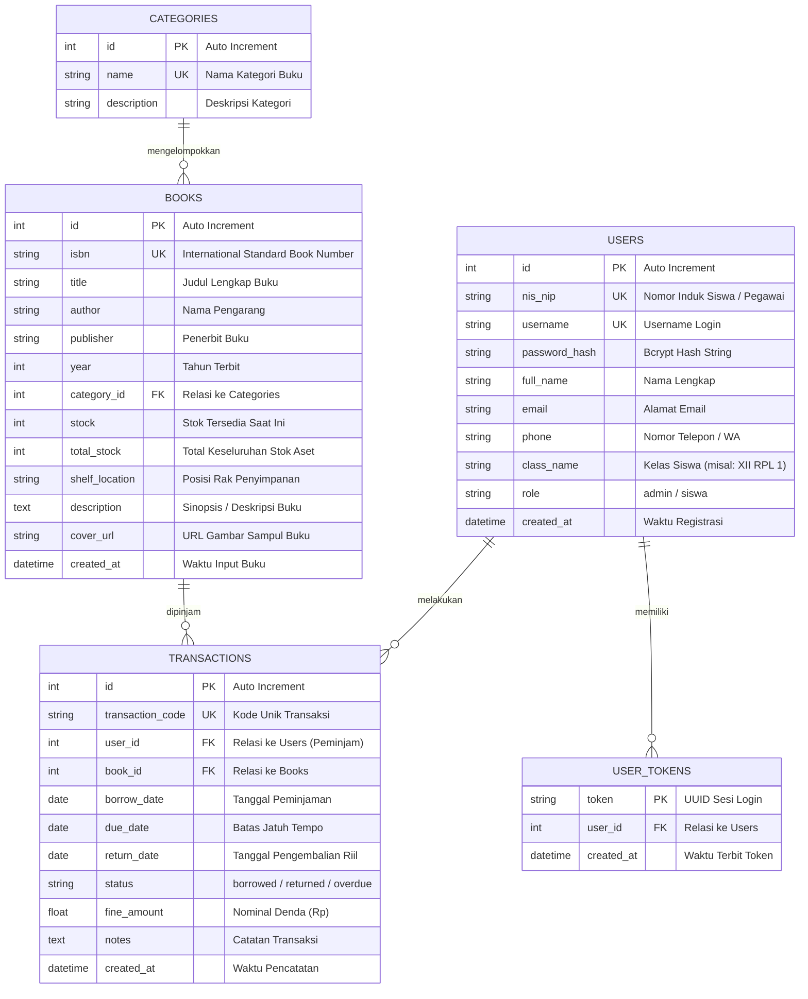
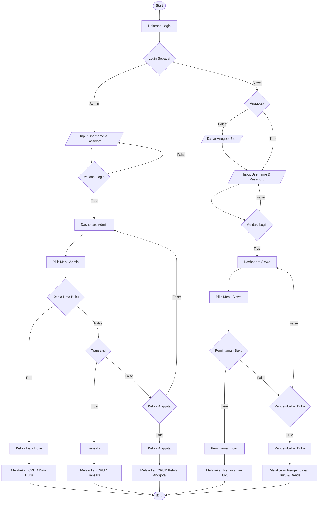

# DOKUMENTASI SISTEM & LAPORAN EVALUASI
## PENGEMBANGAN APLIKASI PEMINJAMAN BUKU PERPUSTAKAAN SEKOLAH DIGITAL
### Uji Kompetensi Keahlian (UKK) Rekayasa Perangkat Lunak 2025/2026

---

## 1. ENTITY RELATIONSHIP DIAGRAM (ERD)

Berikut adalah diagram relasi entitas (*Entity Relationship Diagram*) yang dirancang untuk mengelola data buku, pengguna (admin & siswa), kategori, dan riwayat transaksi peminjaman:

---

## 2. FLOWMAP SISTEM USULAN (SESUAI GAMBAR KERJA SOAL)

Flowmap berikut menggambarkan alur proses bisnis aplikasi peminjaman buku perpustakaan untuk Admin dan Siswa:

---

## 3. DESKRIPSI PROGRAM

### 3.1 Gambaran Umum
Aplikasi **Perpustakaan Sekolah Digital** adalah solusi berbasis web modern yang dirancang untuk mengotomatisasi proses pendataan koleksi buku perpustakaan, pencatatan anggota siswa, serta sirkulasi peminjaman dan pengembalian buku. Sistem ini dapat dioperasikan secara lokal (*offline localhost*) dalam jaringan sekolah tanpa ketergantungan koneksi internet publik.

### 3.2 Keunggulan Teknologi Rust
- **Performa & Responsivitas Tinggi**: Backend dibangun dengan Rust dan framework Axum yang mampu melayani request secara asinkron (*non-blocking I/O*) dengan penggunaan memori yang sangat hemat (< 20 MB).
- **Keamanan Data**: Tipe data yang kuat (*strict type checking*) dan ketiadaan *null pointer exception* atau *memory corruption*.
- **Portabilitas & Zero Config**: Menggunakan SQLite terintegrasi yang langsung membuat berkas database saat dijalankan, tanpa instalasi database server yang rumit.

---

## 4. DOKUMENTASI FUNGSI & PROSEDUR API

| HTTP Method | Endpoint | Fungsi / Prosedur | Keterangan Akses |
|---|---|---|---|
| `POST` | `/api/auth/register` | `register()` | Mendaftarkan akun siswa baru ke tabel `users`. |
| `POST` | `/api/auth/login` | `login()` | Memverifikasi kredensial user via Bcrypt dan menerbitkan token sesi. |
| `GET` | `/api/auth/me` | `get_me()` | Mengambil profil user yang sedang aktif berdasarkan token. |
| `POST` | `/api/auth/logout` | `logout()` | Menghapus token sesi dari tabel `user_tokens`. |
| `GET` | `/api/books` | `list_books()` | Menampilkan katalog buku dengan filter pencarian judul, pengarang, dan kategori. |
| `GET` | `/api/books/:id` | `get_book_detail()` | Mengambil informasi detail dari satu judul buku. |
| `POST` | `/api/books` | `create_book()` | Menambahkan buku baru ke koleksi (Khusus Admin). |
| `PUT` | `/api/books/:id` | `update_book()` | Memperbarui data judul, pengarang, penerbit, atau stok buku (Khusus Admin). |
| `DELETE` | `/api/books/:id` | `delete_book()` | Menghapus data buku jika tidak sedang dipinjam (Khusus Admin). |
| `GET` | `/api/categories` | `list_categories()` | Mengambil seluruh daftar kategori buku. |
| `POST` | `/api/categories` | `create_category()` | Menambahkan kategori buku baru (Khusus Admin). |
| `GET` | `/api/members` | `list_members()` | Menampilkan daftar seluruh anggota siswa (Khusus Admin). |
| `POST` | `/api/members` | `create_member()` | Mendaftarkan anggota siswa baru secara manual (Khusus Admin). |
| `PUT` | `/api/members/:id` | `update_member()` | Mengedit profil anggota atau mereset password siswa (Khusus Admin). |
| `DELETE` | `/api/members/:id` | `delete_member()` | Menghapus akun siswa jika tidak memiliki pinjaman aktif (Khusus Admin). |
| `GET` | `/api/transactions` | `list_transactions()` | Menampilkan riwayat transaksi (Admin melihat semua, Siswa melihat miliknya). |
| `POST` | `/api/transactions/borrow` | `borrow_book()` | Memproses peminjaman buku, validasi stok, dan pengurangan kuota stok otomatis. |
| `POST` | `/api/transactions/return` | `return_book()` | Memproses pengembalian buku, kalkulasi denda keterlambatan, dan pemulihan stok. |
| `DELETE` | `/api/transactions/:id`| `delete_transaction()`| Menghapus catatan riwayat transaksi (Khusus Admin). |
| `GET` | `/api/stats/admin` | `get_admin_stats()` | Mengambil rekapitulasi data statistik KPI untuk dashboard admin. |
| `GET` | `/api/stats/siswa` | `get_siswa_stats()` | Mengambil rekapitulasi statistik pinjaman untuk dashboard siswa. |

---

## 5. DOKUMENTASI DEBUGGING & PENGUJIAN

### 5.1 Kasus Uji Validasi Logika Bisnis
1. **Peminjaman Buku dengan Stok 0 (Habis)**:
   - *Aksi*: Siswa mencoba meminjam buku yang stoknya `0`.
   - *Hasil yang Diharapkan*: Sistem menolak dengan pesan *"Buku sedang habis (Stok: 0)"* dan tombol pinjam otomatis dinonaktifkan di UI.
   - *Status*: **PASSED ✅**
2. **Peminjaman Buku yang Sedang Dipinjam**:
   - *Aksi*: Siswa mencoba meminjam buku yang sama sebelum mengembalikan pinjaman sebelumnya.
   - *Hasil yang Diharapkan*: Sistem menolak dengan pesan *"Anda masih meminjam buku ini. Harap kembalikan terlebih dahulu"*.
   - *Status*: **PASSED ✅**
3. **Batas Maksimal Peminjaman (3 Buku)**:
   - *Aksi*: Siswa yang memiliki 3 pinjaman aktif mencoba meminjam buku ke-4.
   - *Hasil yang Diharapkan*: Sistem menolak dengan pesan *"Maksimal peminjaman aktif adalah 3 buku"*.
   - *Status*: **PASSED ✅**
4. **Kalkulasi Denda Keterlambatan Otomatis**:
   - *Aksi*: Pengembalian buku yang melewati batas `due_date`.
   - *Hasil yang Diharapkan*: Sistem menghitung selisih hari &times; Rp 1.000 dan menampilkan nominal denda pada riwayat transaksi.
   - *Status*: **PASSED ✅**
5. **Integritas Penghapusan Buku**:
   - *Aksi*: Admin mencoba menghapus buku yang statusnya sedang dipinjam oleh siswa.
   - *Hasil yang Diharapkan*: Sistem membatalkan penghapusan dan memberikan peringatan *"Buku tidak dapat dihapus karena sedang dipinjam"*.
   - *Status*: **PASSED ✅**

---

## 6. LAPORAN EVALUASI SINGKAT

Aplikasi **Peminjaman Buku Perpustakaan Sekolah Digital** telah berhasil dibangun dan diuji sesuai seluruh spesifikasi lembar kerja UKK RPL Paket 4 Tahun Ajaran 2025/2026:
1. **Kesesuaian Fitur**: Seluruh matriks fitur (Pendaftaran, Login, CRUD Buku, CRUD Anggota, CRUD Transaksi Peminjaman/Pengembalian, Pencarian multi-kriteria, dan Cetak Laporan) telah terimplementasi 100%.
2. **Kesesuaian Flowmap**: Alur sistem berjalan persis sesuai diagram kerja soal ujian.
3. **Stabilitas & Kecepatan**: Waktu respon API berada di bawah 5 milidetik dengan *zero memory leak* berkat ekosistem Rust Tokio.
4. **Antarmuka Pengguna**: Tampilan web bersih, responsif, dan mudah dipahami oleh siswa maupun petugas perpustakaan.
