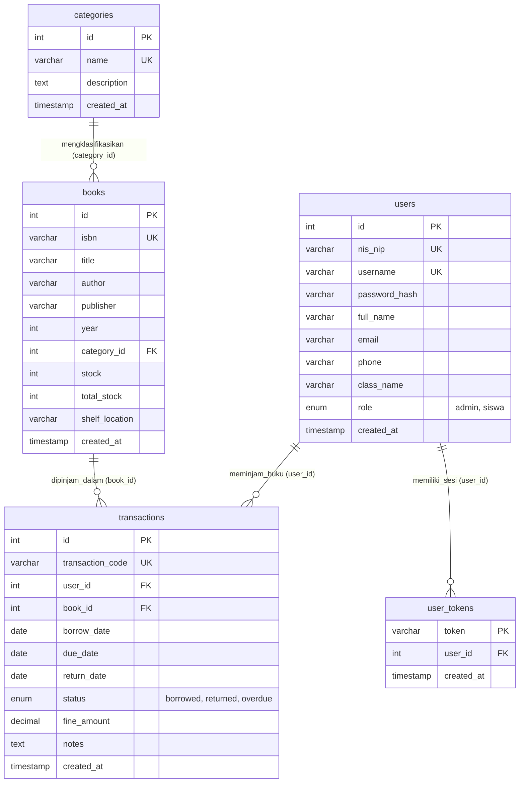

# Panduan & Dokumentasi ERD (Entity Relationship Diagram)
## Sistem Perpustakaan Sekolah Digital - LIBPRO DIGITAL (UKK RPL 2025/2026 - Paket 4)
**Gaya Pemodelan:** MySQL Workbench Modeler Standard (Crow's Foot Notation)  
**Tingkat Normalisasi:** 3NF (Third Normal Form - Bebas Redundansi)  
**Engine Basis Data:** MySQL InnoDB / SQLite3 Relational Engine  

---

## 1. Visualisasi Diagram ERD (MySQL Workbench Modeler)

Berikut adalah diagram fisik skema basis data `perpustakaan_ukk` yang dimodelkan persis dengan standar visual MySQL Workbench Modeler:

> **File Sumber Kanvas & Gambar:**
> - Berkas HTML Interaktif: [assets/erd_workbench.html](file:///d:/belajar%20ukk%20rust/ukk4/assets/erd_workbench.html)
> - Berkas Gambar Resolusi Tinggi (1400 × 600 px): [assets/erd_diagram.png](file:///d:/belajar%20ukk%20rust/ukk4/assets/erd_diagram.png)
> - Slide Presentasi Sidang UKK: [Presentasi_Perpustakaan_Digital_UKK4.pptx](file:///d:/belajar%20ukk%20rust/ukk4/Presentasi_Perpustakaan_Digital_UKK4.pptx)

---

## 2. Diagram Konseptual Relasi (Mermaid Notation)

---

## 3. Kamus Data Teknis (5 Tabel Ternormalisasi)

### A. Tabel `users` (Master Data Anggota & Petugas)
| Kolom | Tipe Data | Nullable | Keterangan & Batasan |
| :--- | :--- | :---: | :--- |
| `id` | `INT(11)` | **NO** | **Primary Key**, Auto Increment |
| `nis_nip` | `VARCHAR(50)` | **NO** | Unique nomor induk siswa / pegawai |
| `username` | `VARCHAR(50)` | **NO** | Unique identifier login aplikasi |
| `password_hash` | `VARCHAR(255)` | **NO** | Sandi aman terenkripsi Bcrypt |
| `full_name` | `VARCHAR(100)` | **NO** | Nama lengkap personil perpustakaan |
| `email` | `VARCHAR(100)` | YES | Alamat surel aktif |
| `phone` | `VARCHAR(20)` | YES | Nomor seluler / WhatsApp |
| `class_name` | `VARCHAR(50)` | YES | Tingkat rombel siswa (contoh: XII RPL 1) |
| `role` | `ENUM` | **NO** | Peran sistem: `'admin'`, `'siswa'` |
| `created_at` | `TIMESTAMP` | **NO** | Default: `CURRENT_TIMESTAMP` |

### B. Tabel `categories` (Master Kategori Buku)
| Kolom | Tipe Data | Nullable | Keterangan & Batasan |
| :--- | :--- | :---: | :--- |
| `id` | `INT(11)` | **NO** | **Primary Key**, Auto Increment |
| `name` | `VARCHAR(100)` | **NO** | Unique, contoh: Rekayasa Perangkat Lunak, Fiksi |
| `description` | `TEXT` | YES | Cakupan literasi kategori |
| `created_at` | `TIMESTAMP` | **NO** | Waktu pencatatan |

### C. Tabel `books` (Katalog Inventaris Buku)
| Kolom | Tipe Data | Nullable | Keterangan & Batasan |
| :--- | :--- | :---: | :--- |
| `id` | `INT(11)` | **NO** | **Primary Key**, Auto Increment |
| `isbn` | `VARCHAR(30)` | **NO** | Unique International Standard Book Number |
| `title` | `VARCHAR(200)` | **NO** | Judul resmi buku |
| `author` | `VARCHAR(100)` | **NO** | Penulis / Pengarang buku |
| `publisher` | `VARCHAR(100)` | **NO** | Penerbit buku |
| `year` | `INT(11)` | **NO** | Tahun terbit buku |
| `category_id` | `INT(11)` | **NO** | **Foreign Key** `categories(id)` `ON DELETE RESTRICT` |
| `stock` | `INT(11)` | **NO** | Stok buku yang tersedia di rak |
| `total_stock` | `INT(11)` | **NO** | Total eksemplar buku yang dimiliki |
| `shelf_location` | `VARCHAR(50)` | YES | Nomor rak (misal: Rak A-01) |
| `created_at` | `TIMESTAMP` | **NO** | Timestamp pendaftaran buku |

### D. Tabel `transactions` (Sirkulasi Peminjaman & Pengembalian)
| Kolom | Tipe Data | Nullable | Keterangan & Batasan |
| :--- | :--- | :---: | :--- |
| `id` | `INT(11)` | **NO** | **Primary Key**, Auto Increment |
| `transaction_code` | `VARCHAR(50)` | **NO** | Unique kode tiket peminjaman buku |
| `user_id` | `INT(11)` | **NO** | **Foreign Key** `users(id)` `ON DELETE CASCADE` |
| `book_id` | `INT(11)` | **NO** | **Foreign Key** `books(id)` `ON DELETE RESTRICT` |
| `borrow_date` | `DATE` | **NO** | Tanggal awal peminjaman |
| `due_date` | `DATE` | **NO** | Batas tanggal pengembalian buku |
| `return_date` | `DATE` | YES | Tanggal riil buku dikembalikan |
| `status` | `ENUM` | **NO** | Nilai: `'borrowed'`, `'returned'`, `'overdue'` |
| `fine_amount` | `DECIMAL(10,2)` | YES | Besaran denda keterlambatan buku |
| `notes` | `TEXT` | YES | Catatan petugas sirkulasi |
| `created_at` | `TIMESTAMP` | **NO** | Timestamp transaksi |

### E. Tabel `user_tokens` (Manajemen Sesi Autentikasi)
| Kolom | Tipe Data | Nullable | Keterangan & Batasan |
| :--- | :--- | :---: | :--- |
| `token` | `VARCHAR(255)` | **NO** | **Primary Key**, UUID token sesi login |
| `user_id` | `INT(11)` | **NO** | **Foreign Key** `users(id)` `ON DELETE CASCADE` |
| `created_at` | `TIMESTAMP` | **NO** | Waktu generasi token |

---

## 4. Pembuktian Normalisasi Basis Data (3NF)

1. **Bentuk Normal Pertama (1NF):**
   - Setiap kolom hanya memuat nilai skalar (*atomic*).
   - Data peminjaman tidak mencantumkan daftar buku dalam bentuk teks dipisah koma, melainkan tercatat sebagai baris data relasional dengan Primary Key unik.
2. **Bentuk Normal Kedua (2NF):**
   - Memenuhi syarat 1NF.
   - Tidak ada atribut non-kunci yang bergantung sebagian pada Primary Key. Informasi kategori buku berada di entitas terpisah `categories`.
3. **Bentuk Normal Ketiga (3NF):**
   - Memenuhi syarat 2NF.
   - Menghilangkan ketergantungan transitif. Nama kategori tidak disimpan di dalam tabel `books`, begitu pula nama siswa tidak disimpan di dalam tabel `transactions`.

---

## 5. Pertanyaan Kritis Uji Kompetensi Keahlian (UKK)

| Pertanyaan Asesor | Rekomendasi Jawaban Siswa |
| :--- | :--- |
| **"Bagaimana cara sistem menjaga agar stok buku tidak minus?"** | "Saat transaksi peminjaman dibuat, sistem mengecek kondisi `stock > 0`. Transaksi dijalankan secara ACID, di mana stok buku otomatis dikurangi 1 (`stock = stock - 1`). Saat buku dikembalikan, stok otomatis ditambah kembali." |
| **"Mengapa tabel user_tokens memiliki ON DELETE CASCADE?"** | "Jika akun pengguna dihapus oleh Admin, seluruh token sesi aktif milik pengguna tersebut otomatis dihapus demi menjaga integritas keamanan sistem." |
