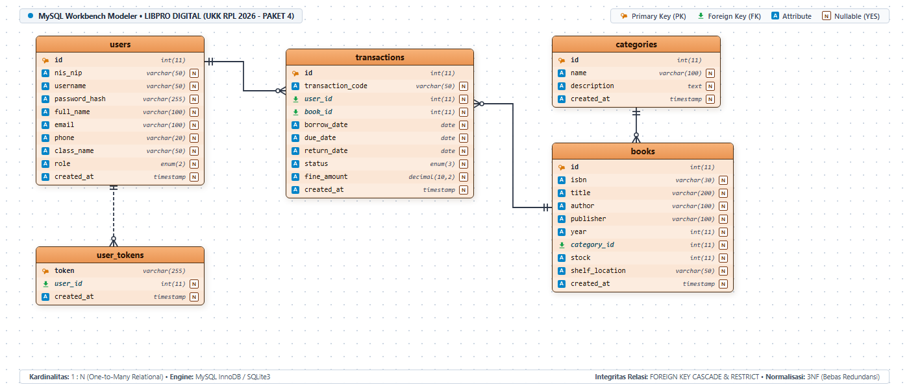

# PANDUAN LENGKAP & TUTORIAL PEMBUATAN APLIKASI
## Peminjaman Buku Perpustakaan Sekolah Digital (UKK RPL 2025/2026 - Paket 4)
### Berbasis Bahasa Pemrograman Rust & Web Modern (Axum + SQLite)

---

## DAFTAR ISI
1. [Latar Belakang & Spesifikasi Soal](#1-latar-belakang--spesifikasi-soal)
2. [Arsitektur & Teknologi yang Digunakan](#2-arsitektur--teknologi-yang-digunakan)
3. [Langkah 1: Persiapan Environment & Tools](#3-langkah-1-persiapan-environment--tools)
4. [Langkah 2: Struktur Proyek Rust & Konfigurasi Cargo.toml](#4-langkah-2-struktur-proyek-rust--konfigurasi-cargotoml)
5. [Langkah 3: Perancangan Database & Seeder Data](#5-langkah-3-perancangan-database--seeder-data)
6. [Langkah 4: Pembuatan Data Model & DTO (models.rs)](#6-langkah-4-pembuatan-data-model--dto-modelsrs)
7. [Langkah 5: Pembuatan Sistem Autentikasi & Keamanan (auth.rs)](#7-langkah-5-pembuatan-sistem-autentikasi--keamanan-authrs)
8. [Langkah 6: Pembuatan REST API Controller (Handlers)](#8-langkah-6-pembuatan-rest-api-controller-handlers)
9. [Langkah 7: Router & Server Axum (main.rs)](#9-langkah-7-router--server-axum-mainrs)
10. [Langkah 8: Perancangan Antarmuka Pengguna (HTML5, CSS3, & JS)](#10-langkah-8-perancangan-antarmuka-pengguna-html5-css3--js)
11. [Langkah 9: Kompilasi, Menjalankan Aplikasi, & Debugging](#11-langkah-9-kompilasi-menjalankan-aplikasi--debugging)
12. [Langkah 10: Panduan Pengujian & Presentasi UKK](#12-langkah-10-panduan-pengujian--presentasi-ukk)

---

## 1. Latar Belakang & Spesifikasi Soal
Pada Uji Kompetensi Keahlian (UKK) Rekayasa Perangkat Lunak Tahun Ajaran 2025/2026 Paket 4 (Kode: KM25.4.1.1), siswa ditugaskan membuat aplikasi **Perpustakaan Sekolah Digital** berbasis web yang berjalan secara lokal (*offline localhost*).

### Matriks Kebutuhan Fitur:
| Fitur | Siswa (User) | Admin (Petugas) |
|---|:---:|:---:|
| **Pendaftaran Akun** | ✅ Ya (NIS, Nama, Username, Password) | ✅ Ya (Otomatis/Seeder Admin) |
| **Login & Logout** | ✅ Autentikasi Siswa | ✅ Autentikasi Petugas Admin |
| **Pemilihan Menu & Dashboard** | ✅ Dashboard Statistik Siswa | ✅ Dashboard Statistik Perpustakaan |
| **Katalog & Pencarian Buku** | ✅ Filter Kategori & Pencarian Kata Kunci | ✅ Filter Kategori & Pencarian |
| **CRUD Transaksi Peminjaman** | ✅ Pinjam Buku & Riwayat | ✅ Rekap Semua Peminjaman Siswa |
| **CRUD Transaksi Pengembalian** | ✅ Ajukan Pengembalian | ✅ Konfirmasi & Hitung Denda |
| **CRUD Data Buku** | ❌ Akses Dibatasi | ✅ Tambah, Edit, Hapus, Kelola Stok |
| **CRUD Kelola Anggota** | ❌ Akses Dibatasi | ✅ Tambah Siswa, Edit, Hapus, Reset Password |
| **Cetak Laporan** | ❌ Akses Dibatasi | ✅ Cetak Rekapitulasi Format Resmi |

---

## 2. Arsitektur & Teknologi yang Digunakan
- **Bahasa Pemrograman Backend**: **Rust** (Edition 2021) — memberikan kecepatan eksekusi tinggi, *memory safety* tanpa garbage collector, dan bebas *data races*.
- **Web Framework**: **Axum** (`v0.7`) didukung oleh asynchronous runtime **Tokio**.
- **Database Engine**: **SQLite** (via crate `rusqlite` bundled) — aplikasi bersifat *zero-configuration*, otomatis membuat file `perpustakaan.db` tanpa perlu menginstal server database terpisah.
- **Keamanan Password**: `bcrypt` dengan salt cost standar industri.
- **Frontend**: Single-Page Web Application menggunakan **HTML5**, **Vanilla CSS (Glassmorphism design system)**, dan **JavaScript murni (Fetch API)**.
- **Format Laporan**: Kompatibel dengan Print CSS / PDF Export.

---

## 3. Langkah 1: Persiapan Environment & Tools
1. Pastikan komputer Anda telah terinstal compiler Rust (Toolchain `rustup` & `cargo`).
   Cek dengan perintah di Command Prompt / PowerShell:
   ```bash
   rustc --version
   cargo --version
   ```
2. Pastikan web browser modern (Google Chrome, Microsoft Edge, atau Mozilla Firefox) telah tersedia.

---

## 4. Langkah 2: Struktur Proyek Rust & Konfigurasi Cargo.toml

Struktur direktori proyek adalah sebagai berikut:
```text
ukk4/
├── Cargo.toml
├── database.sql                  <-- File skema SQL standar UKK
├── perpustakaan.db               <-- File basis data SQLite (dibuat otomatis)
├── src/
│   ├── main.rs                   <-- Entry point server & router
│   ├── models.rs                 <-- Struct data & DTO JSON
│   ├── db.rs                     <-- Koneksi database, migrasi tabel, seeder
│   ├── auth.rs                   <-- Hash password & manajemen sesi token
│   └── handlers/
│       ├── mod.rs
│       ├── auth_handler.rs       <-- Endpoint Login, Register, Me, Logout
│       ├── book_handler.rs       <-- Endpoint CRUD Buku & Kategori
│       ├── member_handler.rs     <-- Endpoint CRUD Anggota Siswa
│       ├── transaction_handler.rs<-- Endpoint Peminjaman, Pengembalian, Denda
│       └── stats_handler.rs      <-- Endpoint KPI Dashboard Admin & Siswa
└── static/
    ├── index.html                <-- Halaman web tunggal (SPA)
    ├── css/
    │   └── style.css             <-- Desain visual & tema glassmorphism
    └── js/
        └── app.js                <-- Logika client, state, Fetch API, routing
```

### Konfigurasi `Cargo.toml`:
```toml
[package]
name = "perpustakaan_ukk"
version = "1.0.0"
edition = "2021"
authors = ["Siswa RPL SMK <siswa@smk.sch.id>"]
description = "Aplikasi Peminjaman Buku Perpustakaan Sekolah Digital - UKK RPL Paket 4"

[dependencies]
axum = { version = "0.7", features = ["macros", "multipart"] }
tokio = { version = "1", features = ["full"] }
tower-http = { version = "0.5", features = ["cors", "trace", "fs"] }
serde = { version = "1.0", features = ["derive"] }
serde_json = "1.0"
rusqlite = { version = "0.31", features = ["bundled"] }
bcrypt = "0.15"
chrono = { version = "0.4", features = ["serde"] }
tracing = "0.1"
tracing-subscriber = { version = "0.3", features = ["env-filter"] }
uuid = { version = "1.8", features = ["v4", "serde"] }
```

---

## 5. Langkah 3: Perancangan Database & Seeder Data (`src/db.rs`)

Berikut visualisasi diagram relasi entitas bergaya **MySQL Workbench Modeler** untuk 5 tabel ternormalisasi 3NF pada sistem LIBPRO DIGITAL:



> 📘 **Dokumentasi Lengkap & Slide Presentasi:**
> - Panduan Detail & Kamus Data: [ERD.md](file:///d:/belajar%20ukk%20rust/ukk4/ERD.md)
> - Berkas Presentasi Sidang: [Presentasi_Perpustakaan_Digital_UKK4.pptx](file:///d:/belajar%20ukk%20rust/ukk4/Presentasi_Perpustakaan_Digital_UKK4.pptx)
> - Kanvas HTML Interaktif: [assets/erd_workbench.html](file:///d:/belajar%20ukk%20rust/ukk4/assets/erd_workbench.html)

Aplikasi ini menggunakan skema relasional 5 tabel utama:
1. `users` (Menyimpan data Admin dan Siswa dengan kolom `nis_nip`, `username`, `password_hash`, `role`).
2. `categories` (Kategori buku).
3. `books` (Data buku, `isbn`, judul, pengarang, penerbit, `stock`, `total_stock`, lokasi rak).
4. `transactions` (Peminjaman & pengembalian, mencakup `borrow_date`, `due_date`, `return_date`, `status`, `fine_amount`).
5. `user_tokens` (Manajemen token autentikasi sesi aktif siswa & petugas).

Saat aplikasi pertama kali dijalankan, fungsi `init_db()` akan:
- Mengaktifkan *Foreign Key Constraints* (`PRAGMA foreign_keys = ON;`).
- Mengeksekusi pembuatan tabel (*DDL*).
- Menjalankan fungsi `seed_data()` untuk mengisi otomatis akun default:
  - **Admin**: Username `admin` | Password `admin123`
  - **Siswa 1**: Username `siswa1` | Password `siswa123`
  - **Siswa 2**: Username `siswa2` | Password `siswa123`
  - Koleksi buku-buku RPL & literasi umum lengkap dengan cover dan stok awal.

---

## 6. Langkah 4: Pembuatan Data Model & DTO (`src/models.rs`)
Menggunakan macro `#[derive(Serialize, Deserialize)]` dari crate `serde` untuk mengonversi data Rust Struct menjadi JSON secara otomatis dan efisien:

```rust
#[derive(Debug, Serialize, Deserialize, Clone)]
pub struct Book {
    pub id: i64,
    pub isbn: String,
    pub title: String,
    pub author: String,
    pub publisher: String,
    pub year: i32,
    pub category_id: i64,
    pub category_name: Option<String>,
    pub stock: i32,
    pub total_stock: i32,
    pub shelf_location: Option<String>,
    pub description: Option<String>,
    pub cover_url: Option<String>,
    pub created_at: String,
}
```

---

## 7. Langkah 5: Keamanan & Autentikasi (`src/auth.rs`)
- Password siswa dan admin di-hash dengan algoritma **Bcrypt** (`bcrypt::hash(password, DEFAULT_COST)`).
- Sesi login menggunakan token unik UUID v4 yang disimpan pada tabel `user_tokens`.
- Setiap request yang membutuhkan otorisasi admin diverifikasi role-nya melalui header `Authorization: Bearer <token>`.

---

## 8. Langkah 6: Logika Bisnis Transaksi & Kalkulasi Denda (`src/handlers/transaction_handler.rs`)
1. **Peminjaman (`borrow_book`)**:
   - Sistem memeriksa ketersediaan stok (`stock > 0`). Jika habis, request ditolak.
   - Sistem memeriksa apakah siswa sedang meminjam buku yang sama yang belum dikembalikan.
   - Sistem membatasi jumlah peminjaman aktif maksimal 3 buku per siswa.
   - Sistem secara otomatis mengurangi stok buku (`UPDATE books SET stock = stock - 1`).
2. **Pengembalian (`return_book`)**:
   - Menghitung selisih hari antara tanggal hari ini dengan tanggal jatuh tempo (`due_date`).
   - Jika terlambat, sistem otomatis mengalikan jumlah hari keterlambatan dengan tarif denda **Rp 1.000 / hari**.
   - Sistem memperbarui status menjadi `returned` dan mengembalikan stok buku (`UPDATE books SET stock = stock + 1`).

---

## 9. Langkah 7: Web Server & Routing (`src/main.rs`)
Mengintegrasikan seluruh API route dan static file serving menggunakan `Axum`:
```rust
let app = Router::new()
    .nest("/api", api_routes)
    .fallback_service(ServeDir::new("static").append_index_html_on_directories(true))
    .layer(cors);

let listener = tokio::net::TcpListener::bind("0.0.0.0:3000").await?;
axum::serve(listener, app).await?;
```

---

## 10. Langkah 8: Antarmuka Web (UI/UX Modern)
- **Desain Responsive**: Menyesuaikan tampilan di monitor 14" laptop maupun desktop.
- **Glassmorphism**: Navigasi transparan dengan efek `backdrop-filter: blur(12px)`.
- **Live Search**: Pencarian instan tanpa perlu reload halaman.
- **Cetak Laporan**: Fitur cetak rapi dengan kop surat resmi perpustakaan dan kolom tanda tangan penguji UKK.

---

## 11. Langkah 9: Kompilasi & Menjalankan Aplikasi

Jalankan perintah berikut di terminal:
```bash
# 1. Masuk ke direktori proyek
cd "d:\belajar ukk rust\ukk4"

# 2. Jalankan aplikasi menggunakan Cargo
cargo run
```

Setelah muncul tulisan `Aplikasi berjalan di: http://localhost:3000`, buka browser Anda dan akses:
👉 **`http://localhost:3000`**

---

## 12. Langkah 10: Panduan Pengujian & Presentasi UKK

### Skenario Pengujian yang Ditunjukkan ke Penguji:
1. **Pendaftaran Siswa Baru**: Klik "Masuk / Daftar" -> "Daftar Siswa Baru" -> Masukkan NIS, Nama, Kelas, Username, Password.
2. **Login Siswa**: Masuk dengan akun siswa yang baru dibuat.
3. **Peminjaman Buku**: Buka Katalog Buku -> Pilih buku dengan stok tersedia -> Klik "Pinjam" -> Tentukan durasi pinjam -> Konfirmasi.
4. **Verifikasi Stok**: Pastikan stok buku di katalog berkurang 1.
5. **Dashboard Siswa & Pengembalian**: Buka menu "Peminjaman Saya" -> Klik "Kembalikan Buku".
6. **Login Admin**: Logout lalu login dengan user `admin` / `admin123`.
7. **CRUD Buku**: Buka menu "Kelola Buku" -> Tambah buku baru -> Edit data buku -> Hapus buku.
8. **CRUD Anggota**: Buka menu "Kelola Anggota" -> Tambah siswa baru -> Reset password -> Hapus siswa.
9. **Cetak Laporan**: Buka menu "Transaksi" -> Klik "Cetak Laporan PDF" -> Pratinjau cetak muncul dengan kop surat dan tabel rekapitulasi.
